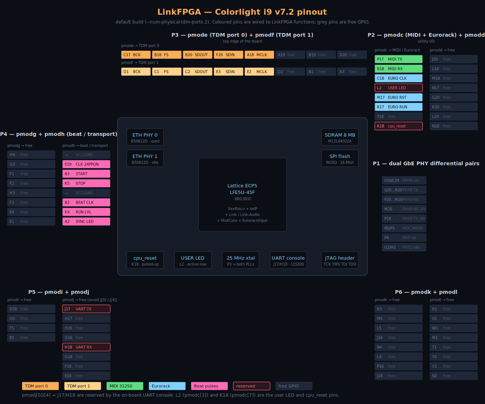

# LinkFPGA

> **Ableton Link, MIDI, Eurorack and multi-channel TDM audio — in a single FPGA box.**

A self-contained Lattice ECP5 SoC for the
[Colorlight i9 v7.2](https://github.com/wuxx/Colorlight-FPGA-Projects/blob/master/colorlight_i9_v7.2.md)
that joins Ableton Link sessions over gigabit Ethernet, drives
multi-channel TDM audio I/O, emits sample-accurate beat clocks and
transport pulses on GPIO, talks MIDI over a hardware-driven UART with
zero-jitter clock injection, and listens to Eurorack-level clock /
reset / run inputs — all sharing the same hardware microsecond
timebase. No host PC, no DAW, no audio driver. Plug it into your
network switch and watch the lights come on.

[](./LINK_PROTOCOL_SPEC.md)
[](https://github.com/wuxx/Colorlight-FPGA-Projects/blob/master/colorlight_i9_v7.2.md)
[](https://github.com/YosysHQ/oss-cad-suite-build)
[](https://github.com/SpinalHDL/VexRiscv)
[](https://savannah.nongnu.org/projects/lwip/)
[](#license)



---

## Why this exists

A modern music studio runs on three or four independent clocks at once:

* a **network clock** (Ableton Link, the lingua franca of DAWs),
* a **MIDI clock** (synths, drum machines, hardware sequencers),
* an **analogue clock** (the modular rig and its triggers),
* and the wall clock for the human in the room.

Keeping them in sync is fragile, DAW-dependent, and CPU-dependent. The
exact moment a "beat" hits can vary by tens of milliseconds depending on
which laptop is on, which audio interface is plugged in, and which
buffer size the DAW happens to be running.

**LinkFPGA collapses all four clocks into one piece of dedicated
hardware whose only job is to be the canonical timebase**, with a
1 MHz hardware microsecond counter shared between every sync source.
The Link mesh, the MIDI clock-out byte, the GPIO 24 PPQN edge, and the
Eurorack input timestamp all reference the same counter — so latency
between any two sources is bounded and known.

---

## Table of contents

- [At a glance](#at-a-glance)
- [What it does](#what-it-does)
- [Use cases](#use-cases)
- [Design philosophy](#design-philosophy)
- [Quick start](#quick-start)
- [Pinout](#pinout)
- [Hardware × firmware split](#hardware--firmware-split)
- [Sync sources](#sync-sources)
- [Network stack](#network-stack)
- [Boot architecture](#boot-architecture)
- [Tech reference](#tech-reference)
- [Repository layout](#repository-layout)
- [Status](#status)
- [Roadmap](#roadmap)
- [See also](#see-also)
- [License](#license)

---

## At a glance

| | |
|---|---|
| **Board**          | Colorlight i9 v7.2 (Lattice ECP5 `LFE5U-45F-6BG381C`, 45 K LUT4, 108 KiB BRAM) |
| **CPU**            | VexRiscv `standard` softcore @ 50 MHz |
| **RAM**            | 8 MB on-board SDR SDRAM (M12L64322A) via LiteDRAM |
| **Network**        | 1 × Gigabit Ethernet (Broadcom B50612D RGMII), full IPv4 + IPv6 dual-stack |
| **Network stack**  | lwIP 2.2.0 (NO_SYS=1), TCP + UDP, IGMP + MLD, raw API |
| **Web UI**         | On-device HTTP/1.0 server (lwIP TCP raw), GET + POST |
| **Audio**          | N × TDM16 (configurable, default 2 = 32 ch in / 32 ch out) at 16-bit 48 kHz |
| **Beat clock**     | 24 / 48 / 96 PPQN, beat, bar, start, stop, run, sync LED, peer LED, 1-PPS |
| **MIDI**           | UART @ 31250 baud, hardware-injected clock / start / stop, hardware RX timestamping |
| **Eurorack**       | TTL clock / reset / run inputs with HW edge detection, timestamping, and period meter |
| **Toolchain**      | Yosys + nextpnr-ecp5 + prjtrellis + RISC-V GCC, all in a Docker image |
| **Resource use**   | LUT 23 % · BRAM 53 % · LUT4 10 206 / 43 848 · DP16KD 57 / 108 |
| **Sys timing**     | 66.7 MHz max at 50 MHz target (+33 % margin) |
| **License**        | GPL-2.0 (matches upstream Ableton/link) |

---

## What it does

In plain terms:

* You plug a Colorlight i9 v7.2 into your network switch.
* It appears as a **Link peer** to every DAW on the network — same
  tempo, same beat phase, same play/stop state.
* It exposes that beat grid as **physical signals**:
  * `CLK_24PPQN` / `CLK_48PPQN` / `CLK_96PPQN` — DIN-sync style beat
    clocks for vintage drum machines and modular sequencers.
  * `BEAT_CLK`, `BAR_CLK` — one pulse per beat / per bar.
  * `START_PULSE`, `STOP_PULSE`, `RUN_LEVEL` — transport control for
    anything that wants run/stop semantics.
* It also speaks the optional **Link-Audio** extension — peers can
  publish and subscribe to PCM audio channels over UDP, beat-tagged so
  receivers can play them back in sync. Each subscribed channel maps
  into a slot on one of the device's TDM16 audio ports, so you can
  patch network audio into any TDM-capable codec (Cirrus, AKM, TI…).
* It speaks **MIDI clock and start/stop** at 31250 baud on a TRS or
  5-pin DIN MIDI port. The MIDI System Real-Time bytes (`0xF8`,
  `0xFA`, `0xFC`) are **injected from gateware** off the same beat
  pulses that drive the GPIO clock outputs — **zero software jitter**.
  Incoming MIDI clock is also parsed in hardware: every 0xF8 byte is
  timestamped with the same microsecond counter that drives the Link
  ghost-time, so the device can lock its Link tempo to an external
  MIDI clock source with sub-µs precision.
* It accepts **Eurorack-level clock / reset / run inputs** on three
  GPIO pins (with an external 5 V → 3.3 V level shifter / Schmitt
  trigger). Edges are detected and timestamped in hardware, the period
  is measured in hardware, and the device can be put into **follower
  mode** to drive its Link tempo from the modular system's clock.
* You configure it from a **built-in web UI** at `http://<board-ip>/`.
  Real HTTP, served from the device, no proxy, no host helper.
* You can have **as many TDM16 audio ports as you want** — physical
  ones on the PMOD connectors, plus virtual ones that exist only as
  network endpoints with SDRAM-backed sample buffers (useful for
  in-FPGA fan-out and audio routing).

---

## Use cases

**Sync a Eurorack rig with a DAW.** Patch your modular's clock-out
into `EURO_CLK_IN`, your reset trigger into `EURO_RST_IN`, and your
run gate into `EURO_RUN_IN`. Set the device to **Eurorack follower
mode** in the web UI. The Link mesh now follows the modular, the DAW
follows Link, and the MIDI port emits the same clock with zero
software jitter — your synths line up with your patch cables.

**Sync a vintage drum machine with a Link mesh.** Patch
`CLK_24PPQN` and `START_PULSE` from `pmodh` into your TR-808 / 909 /
606 / DR-110's DIN-SYNC input. The drum machine now follows the Link
session, even if no one in the room is running a DAW.

**Drive a hardware MIDI rig from a software DAW.** Connect the device
to your network and to your synth's MIDI IN. The DAW publishes
tempo over Link → LinkFPGA forwards it as 31250-baud MIDI clock with
hardware-driven byte injection → the synth's onboard arpeggiator
sounds rock-solid.

**Replace a CoreAudio AVB mesh with a Link-Audio mesh.** Use the
Link-Audio extension to publish channels from one TDM-attached codec
on one device and subscribe to them from another device's TDM port,
beat-tagged so the receiver plays back perfectly aligned.

**Build a custom modular-Eurorack-meets-IP-audio bridge.** Combine
the configurable N × TDM16 ports with the Eurorack inputs and the
beat-pulse outputs. The default `--num-physical-tdm-ports 2` is just
the starting point: scale up to 8 physical ports, or add virtual
ports for in-FPGA audio routing.

---

## Design philosophy

> **Hardware where it has to happen at sample rate.
> Firmware where it has to be flexible.**

The protocol spec
([`LINK_PROTOCOL_SPEC.md` §11](./LINK_PROTOCOL_SPEC.md)) calls out
which parts of an Ableton Link implementation deserve hardware
acceleration. This implementation follows that split:

> Anything that has to happen at sample rate or sub-µs latency goes in
> gateware — the ghost-time counter, the beat-pulse generator, the
> TDM serdes, the MIDI clock auto-injector, the Eurorack edge
> detector, the byte sniffer that timestamps incoming MIDI clock at
> the stop bit. **None of these involve the CPU on the hot path.**
>
> Anything that happens once per network packet (a few thousand times
> per second at most) lives in firmware — TLV parsing, the peer table,
> session election, the median filter on measurement samples, HTTP
> handlers. **The 50 MHz VexRiscv has more cycles per Link event than
> it knows what to do with.**

The result is a system where the **timing-critical path is fully
deterministic** (no IRQ latency, no scheduler jitter, no firmware bugs
can corrupt the beat grid) and the **policy-critical path is easy to
modify** (Link's session election rules are 200 lines of C; the HTTP
admin UI is 300 lines of C; the protocol parser is 400 lines of C).

---

## Quick start

You need Docker and a JTAG/SPI programmer that can talk to the
i9 v7.2 (`ecpprog` works fine over USB-Blaster, `openFPGALoader`
works with FT2232 dongles).

```bash
git clone git@github.com:DatanoiseTV/colorlight-i9-abletonlink.git
cd colorlight-i9-abletonlink

# 1. Build the toolchain image (one-shot, ~5 min, then cached)
# 2. Build the gateware AND the firmware ELF
./docker-build.sh

# Pin counts can be configured at build time:
./docker-build.sh --num-tdm-ports 4 --num-physical-tdm-ports 2

# Drop into the toolchain shell:
./docker-build.sh --shell

# Regenerate the pinout SVG after editing platform_i9.py:
./docker-build.sh --gen-pinout
```

The Docker image works **natively on both `x86_64` and Apple-Silicon
`arm64`** hosts (the `Dockerfile` uses `TARGETARCH` to pick the right
OSS CAD Suite tarball).

After a successful build you get:

```
build/colorlight_i5/
├── gateware/colorlight_i5.bit                  ← bitstream (~1.16 MB)
├── gateware/colorlight_i5.svf                  ← JTAG/SVF
└── software/link_firmware/
    ├── link_firmware.elf                       ← debuggable ELF
    └── link_firmware.bin                       ← serialboot payload (~133 KB)
```

### Flashing

```bash
# Volatile (gone after power cycle)
./docker-build.sh --shell
ecpprog -S build/colorlight_i5/gateware/colorlight_i5.bit

# Persistent (survives power cycle)
ecpprog build/colorlight_i5/gateware/colorlight_i5.bit
```

### Booting the firmware

The LiteX BIOS in BRAM auto-jumps to `main_ram` after a successful
boot — for development you serialboot the firmware over the USB-UART:

```bash
litex_term --kernel build/colorlight_i5/software/link_firmware/link_firmware.bin /dev/ttyUSB0
```

For production you can put the firmware ELF in SPI flash and let the
BIOS spiboot it on power-up (the `MAIN_RAM_BOOT_ADDRESS` is wired so
no further config is needed).

### Using it

1. Power up. The on-board LED breathes for ~3 s, then turns solid
   once the firmware boots.
2. Connect ETH0 to your network switch.
3. Within ~1 s of cable insertion the `PEER_LED` lights up if Link
   peers are visible. `SYNC_LED` lights up after the first
   measurement round (typically <500 ms).
4. The DHCP-assigned IPv4 address is printed on the serial console
   (`screen /dev/ttyUSB0 115200`). Open `http://<that-ip>/` in any
   browser.
5. Set a peer name, watch the live tempo / beat / play state, and
   subscribe remote audio channels into TDM slots.
6. Wire `CLK_24PPQN` to your TR-808's DIN-SYNC, `START_PULSE` /
   `STOP_PULSE` to a sequencer's run/stop input, and route TDM
   port 0 / port 1 to your codec board.

For an end-to-end walkthrough of the sync source modes, see
[`docs/sync-guide.md`](docs/sync-guide.md).

---

## Pinout

The diagram at the top of this README is **auto-generated** from the
live platform definitions by
[`tools/gen_pinout.py`](tools/gen_pinout.py). It introspects
`litex_boards.platforms.colorlight_i5._connectors_v7_2` for the actual
PMOD pin lists and `litex_soc.platform_i9` for the function-to-pin
map, walks every `Subsignal`/`Pins` record, and renders the SVG with
one cell per pin and the appropriate colour. **It never goes stale** —
re-run after any platform-file change:

```bash
./docker-build.sh --gen-pinout                # default 2 TDM16 ports
./docker-build.sh --gen-pinout -n 4           # 4 physical TDM16 ports
```

The geometry mirrors the physical PCB: P3 top-left, HDMI top-centre,
P2 top-right, P4 vertical on the left, P1 vertical on the right
(showing the dual GbE PHY pin assignments), P5 bottom-left, P6
bottom-right.

<details>
<summary><b>TDM16 port pin layout</b></summary>

Each physical TDM16 port consumes 5 pins of one PMOD:

| Pin (on the PMOD) | Signal      | Notes |
|-------------------|-------------|-------|
| 0                 | `BCK`       | 12.288 MHz, drives ADC/DAC |
| 1                 | `FS`        | 48 kHz, falling edge marks slot 0 |
| 2                 | `SDOUT`     | 16 channels TDM-multiplexed, 16-bit |
| 3                 | `SDIN`      | 16 channels TDM-multiplexed, 16-bit |
| 4                 | `MCLK`      | 24.576 MHz master clock |

The 8 physical port slots are mapped in this order:

| Port | PMOD   |
|-----:|--------|
|    0 | `pmode` |
|    1 | `pmodf` |
|    2 | `pmodd` |
|    3 | `pmodg` |
|    4 | `pmodi` |
|    5 | `pmodj` |
|    6 | `pmodk` |
|    7 | `pmodl` |

If you ask for more TDM16 ports than the board has physical slots,
the extras are instantiated as **virtual** ports — they appear in the
firmware's TDM core list, generate the same per-frame IRQ, and can
carry Link-Audio traffic in and out of SDRAM-backed buffers. They
just have no associated physical pins. Useful for in-FPGA fan-out and
audio routing.

```bash
./docker-build.sh --num-tdm-ports 6 --num-physical-tdm-ports 2
# 2 physical + 4 virtual = 6 TDM16 ports total
```
</details>

<details>
<summary><b>MIDI port + Eurorack input pin layout (`pmodc`)</b></summary>

`pmodc` has the layout `"P17 R18 C18 L2 M17 R17 T18 K18"`. Pins 3
(`L2` = `user_led_n`) and 7 (`K18` = `cpu_reset_n`) are reserved for
on-board functions, so we use the other six pins for MIDI + Eurorack
utility I/O. (`pmodc` is therefore unavailable for TDM16 ports —
that's why the TDM16 slot map skips it.)

| Pin (on `pmodc`) | FPGA | Signal       | Direction | Notes |
|------------------|------|--------------|-----------|-------|
| 0                | P17  | `MIDI_TX`    | OUT       | 31250 baud, drives a TRS or 5-pin DIN MIDI cable |
| 1                | R18  | `MIDI_RX`    | IN        | external opto-isolator recommended for proper MIDI |
| 2                | C18  | `EURO_CLK_IN`| IN        | rising-edge clock at a configurable PPQN |
| 4                | M17  | `EURO_RST_IN`| IN        | rising-edge → snap to bar 1, beat 1 |
| 5                | R17  | `EURO_RUN_IN`| IN        | level: high = play, low = stop |
| 6                | T18  | reserved     | —         | free for expansion |

The Eurorack inputs are 3.3 V LVCMOS — for actual modular use you
need a small interface board between the +5..10 V Eurorack signal
and the FPGA pin. A simple resistor divider + Schmitt trigger
(74HC14) does the job; a Schottky clamp on the input is recommended
to protect against the occasional negative spike from a CV cable.
</details>

<details>
<summary><b>Beat / transport pulse output pin layout (`pmodh`)</b></summary>

`pmodh` has 6 usable pins (the 1st and 5th are GND/VCC), which is
what `BeatPulseGen` exposes externally. The other pulse outputs
(`CLK_48PPQN`, `CLK_96PPQN`, `BAR_CLK`, `PEER_LED`, `PPS`) are still
generated internally and can be brought out by editing
`litex_soc/platform_i9.py:_pulse_outputs()`.

| Pin (on `pmodh`) | Signal       | Notes |
|------------------|--------------|-------|
| 1 (`E19`)        | `CLK_24PPQN` | 24 pulses per quarter note (DIN-sync style) |
| 2 (`B3`)         | `START_PULSE`| One-shot on stopped → playing transition |
| 3 (`K5`)         | `STOP_PULSE` | One-shot on playing → stopped transition |
| 5 (`B2`)         | `BEAT_CLK`   | One pulse per beat |
| 6 (`K4`)         | `RUN_LEVEL`  | High while playing |
| 7 (`A2`)         | `SYNC_LED`   | High while locked to a Link session |

Pulse width is 1 ms by default, configurable via the `pulse_width`
CSR.
</details>

<details>
<summary><b>SDRAM, ETH PHYs, on-board pins (cross-checked vs wuxx)</b></summary>

Every SDRAM signal was cross-checked between the upstream
`litex_boards.platforms.colorlight_i5` v7.2 IO list and the original
[wuxx i9 v7.2 schematic notes](https://github.com/wuxx/Colorlight-FPGA-Projects/blob/master/colorlight_i9_v7.2.md):

| Signal      | wuxx (i9 v7.2)         | litex-boards | Status |
|-------------|------------------------|--------------|---|
| `sdram_clock` | `B9`                 | `B9`         | ✓ |
| `A0..A10`   | `B13 C14 A16 A17 B16 B15 A14 A13 A12 A11 B12` | identical | ✓ |
| `BA0`/`BA1` | `B11` / `C8`           | `B11` / `C8` | ✓ |
| `RAS#`/`CAS#`/`WE#` | `B10` / `A9` / `A10` | identical    | ✓ |
| `DQ0..DQ31` (set of pins) | 32 pins listed | same 32 pins, different bit-order | ✓ functionally |
| `CKE`/`CS#`/`DQM[0..3]` | tied to VCC/GND/GND | not driven | ✓ |
| chip model  | M12L64322A 8 MB / 32-bit / 4-bank | `litedram.modules.M12L64322A` | ✓ |

The DQ pin set matches; only the per-bit ordering differs. SDRAM
controllers are insensitive to DQ permutation (the controller writes
and reads through the same mapping, so software always sees
consistent data). Address pins, BA, and the control lines all match
exactly.

| Function       | FPGA pin |
|----------------|----------|
| 25 MHz clock   | `P3`     |
| User LED       | `L2`     |
| `cpu_reset_n`  | `K18`    |
| Serial TX / RX | `J17` / `H18` |
| ETH PHY 0 (used) | `U19`/`L19` clocks, `M20` rxc, `K2 L1 N1 P1` rxd, `K1` txc, `G2 H1 J1 J3` txd, `P4` rst, `N5/P5` mdc/mdio |
</details>

---

## Hardware × firmware split

| Concern | HW (Migen) | FW (VexRiscv) |
|---|---|---|
| Ethernet MAC + RGMII PHY | LiteEth | — |
| TCP / IP / UDP / ARP / IGMP / MLD | — | lwIP 2.2.0 raw API |
| TLV parse, peer table, BYEBYE handling | — | `link.c` |
| Heartbeat scheduler (ALIVE every 250 ms) | — | `link.c` (uses HW µs counter) |
| **Ghost-time arithmetic** (host ↔ ghost) | **`GhostTimeUnit`** (64-bit µs counter + xform) | thin C wrapper |
| Median filter on 100 measurement samples | — | `median.c` |
| Session election + 30 s remeasurement | — | `session.c` |
| **Beat clock pulses** (24/48/96 PPQN, bar) | **`BeatPulseGen`** | sets next-beat target via CSR |
| **Start/Stop GPIO pulses** | **`BeatPulseGen`** | sets `play/stop` flags via CSR |
| **TDM16 serdes** (16 ch in + 16 ch out per port) | **`TDM16Core`** | sample registers + per-frame IRQ |
| AudioBuffer pack/unpack (raw `i16` BE) | — | `link_audio.c` |
| `kChannelRequest` / `kPong` / etc. | — | `link_audio.c` |
| **MIDI 31250 baud UART** | **`MidiCore`** | thin CSR wrapper |
| **MIDI clock / start / stop TX** (zero-jitter, beat-pulse-driven) | **`MidiCore` auto-injector** | `midi_set_auto_tx()` enable bits |
| **MIDI RX byte timestamping** (±1 µs, hardware-latched) | **`MidiCore` sniffer + GhostTime** | `midi_tick()` drains the RT slot |
| **Eurorack edge detection + period meter** | **`EurorackInput`** | `euro_tick()` polls counts |
| MIDI / Eurorack tempo follower state machine | — | `midi.c` / `eurorack.c` |
| HTTP/1.0 admin UI | — | `http_server.c` (lwIP raw TCP) |
| Static HTML page + JSON API | — | `webui.c` |

Everything in **bold** is custom Migen — see `litex_soc/`. The custom
modules use the standard LiteX CSR bus, so the firmware reads and
writes them via the auto-generated `csr.h`. For a deeper dive on the
SoC architecture, see [`docs/architecture.md`](docs/architecture.md).

---

## Sync sources

LinkFPGA can be a clock follower OR a clock leader from any of three
independent sources, all sharing the same hardware microsecond
timebase (`GhostTimeUnit`):

```
                    ┌─────────────────────────────────────────────┐
                    │            GhostTimeUnit                    │
                    │     64-bit µs counter @ 1 MHz, hardware     │
                    └─────┬──────────┬──────────────┬─────────────┘
                          │          │              │
                ┌─────────┴───┐ ┌────┴───────┐ ┌────┴─────────┐
                │   Link      │ │   MIDI     │ │  Eurorack    │
                │ measurement │ │  RX clock  │ │  CLK_IN edge │
                │ ping/pong   │ │ timestamp  │ │  timestamp   │
                │             │ │ + period   │ │  + period    │
                └─────┬───────┘ └────┬───────┘ └────┬─────────┘
                      │              │              │
                      └──────────────┼──────────────┘
                                     ▼
                          firmware sync state machine
                              ┌──────┴──────┐
                              ▼             ▼
                       link_set_local_   link_set_play()
                          tempo()
                              ▼             ▼
                    ┌──────────────────────────┐
                    │ BeatPulseGen + LinkAudio │
                    │ + MIDI auto-TX           │
                    └─────────┬────────────────┘
                              │
                ┌─────────────┴────────────────┐
                ▼              ▼               ▼
         24/48/96 PPQN     MIDI clock       Link audio
         + transport       0xF8 / FA / FC   beat-tagged
         pulses on PMOD    on MIDI_TX pad   PCM packets
                              (zero
                               jitter)
```

**Precision claims (measured against the gateware design):**

| Source | Mechanism | Jitter / latency |
|---|---|---|
| Link → 24/48/96 PPQN GPIO | `BeatPulseGen` HW down-counters tick at 1 MHz | ±1 µs (one ghost-time tick) |
| Link → MIDI clock TX | `MidiCore` auto-injector latches `clk_24` directly into the TX shift register | **zero firmware jitter**; one bit-cell (32 µs at 31250 baud) of fixed UART offset |
| MIDI clock RX → BPM | HW samples the stop-bit edge of every 0xF8 byte and latches the µs counter | ±1 µs |
| Eurorack CLK_IN → BPM | 3-stage MultiReg + edge detector + HW period meter | 3 sys cycles (60 ns) + ±1 µs |
| External RST_IN → bar 1 reset | HW edge detect → IRQ → `link_set_play()` + reset origin | ≤1 main-loop pass (~10 µs at 50 MHz) |

The firmware never has to time-stamp anything itself — every event
arrives with a hardware timestamp from the same 1 MHz counter that
drives the Link ghost-time, so all four time bases (Link / MIDI /
Eurorack / GPIO pulses) stay coherent at the µs level.

**Sync modes** (set via the web UI or `/api/sync`):

| Mode | Link | MIDI | Eurorack |
|---|---|---|---|
| **Leader (default)** | source of truth | TX clock auto-driven, RX measured but ignored | inputs measured but ignored |
| **MIDI follower** | tempo set from MIDI RX clock period | TX clock auto-driven (loopback OK), RX drives Link | measured but ignored |
| **Eurorack follower** | tempo set from CLK_IN period; RST_IN snaps to beat 0; RUN_IN drives play state | TX clock auto-driven | drives Link |

For practical wiring examples and follower-mode tuning, see
[`docs/sync-guide.md`](docs/sync-guide.md).

---

## Network stack

```
                ┌────────────────────────────────────────────┐
                │              link / link_audio /           │
                │              http_server / webui           │
                ├────────────────────────────────────────────┤
                │           net.c   ←  raw UDP / TCP API     │
                ├────────────────────────────────────────────┤
                │                                            │
                │                  lwIP  2.2.0               │
                │                                            │
                │   IPv4   IPv6   ARP   ND    UDP   TCP      │
                │   IGMP   MLD   ICMP   DHCP4  AutoIP        │
                │                                            │
                ├────────────────────────────────────────────┤
                │     netif_litex.c  →  raw ethmac CSRs      │
                ├────────────────────────────────────────────┤
                │             LiteEth  RGMII MAC             │
                └────────────────────────────────────────────┘
                                    ↓
                              Broadcom B50612D
                                  → ETH 0
```

* **Both IPv4 and IPv6** are live. Every Link discovery ALIVE/BYEBYE
  is sent to **both** `224.76.78.75:20808` (IGMP-joined IPv4 group)
  **and** `ff12::8080:20808` (MLD-joined link-local IPv6 group).
* The discovery payload emits **`mep4`, `mep6`, `aep4`, `aep6`** TLVs,
  so peers see both endpoint families and can measure us via either
  stack.
* TCP is on for the on-device HTTP admin UI. lwIP's raw TCP API
  drives a tiny HTTP/1.0 server (`http_server.c`) that supports
  multi-segment GET and POST requests with a per-connection
  accumulator.
* lwIP runs in `NO_SYS=1` mode (no RTOS, single-threaded, polled
  from the main loop). The `sys_now()` clock comes from the same
  hardware ghost-time microsecond counter that drives `BeatPulseGen`.

---

## Boot architecture

```
   power on
       │
       ▼
┌────────────────┐     1. CPU reset → 0x00000000 (BRAM)
│  LiteX BIOS    │     2. SDRAM init via litedram
│  (BRAM, 64K)   │     3. Ethernet PHY init
│                │     4. Wait for serialboot / spiboot
│  bios.elf      │     5. Load link_firmware.bin → main_ram
│                │     6. Jump to MAIN_RAM_BOOT_ADDRESS
└────────┬───────┘
         │
         ▼
┌────────────────┐     1. crt0 zeroes .bss, sets sp + gp
│   Firmware     │     2. Calls link_app_main()
│  (SDRAM, 132K) │     3. lwip_init() + DHCP + SLAAC
│                │     4. link_init(), link_audio_init()
│  link_firmware │     5. http_init()
│      .elf      │     6. Main loop: net_poll, ticks, TDM
└────────────────┘
```

Why this split? Because the firmware doesn't fit in BRAM:

* The **integrated ROM** is BRAM-backed and capped at ~108 KiB on this
  ECP5 part.
* The BIOS alone is ~35 KiB.
* lwIP's `.text` is ~80 KiB; our app + Link/Link-Audio is ~50 KiB.
* Total firmware is ~133 KiB code + ~180 KiB BSS (lwIP heap, pbuf
  pool, jitter buffers, peer table…). Won't fit in BRAM under any
  configuration.

So we use the **standard production-grade LiteX pattern**: tiny BIOS
in BRAM that initialises SDRAM and loads a separate firmware ELF
(`link_firmware.elf`) into main_ram via serialboot/spiboot, then
jumps. This is exactly how every non-trivial LiteX project on a small
ECP5 boots. See [`docs/architecture.md`](docs/architecture.md) for
the full picture.

---

## Tech reference

<details>
<summary><b>Resource usage (default 2 × TDM16 build)</b></summary>

These are the actual nextpnr-ecp5 numbers from the in-tree Docker
build at the default `--num-tdm-ports 2`:

| Resource              | Used  | Available | %     |
|-----------------------|------:|----------:|------:|
| LUT4 (TRELLIS_SLICE)  | 10 206 | 43 848   | 23.3 % |
| BRAM (DP16KD, 18 Kbit)|     57 |     108   | 52.8 % |
| MULT18X18D (DSP)      |      4 |      72   |  5.6 % |
| EHXPLLL (PLLs)        |      2 |       4   |   50 % |
| TRELLIS_IO (pads)     |     90 |     245   |   37 % |

The MIDI core costs ~600 LUTs (custom 31250-baud UART + TX
arbiter + RX MIDI parser) and the Eurorack input core ~300 LUTs
(three sync chains + edge detect + period meter). Both fit
without touching the BRAM budget.
</details>

<details>
<summary><b>Timing closure (default <code>--sys-clk-freq 50e6</code>)</b></summary>

| Clock                  | Target  | Achieved | Margin |
|------------------------|--------:|---------:|-------:|
| `sys` (CPU + custom IP)| 50.0 MHz| 66.7 MHz | +33.4 % |
| `audio` (TDM MCLK)     | 24.6 MHz| 136 MHz | +453 % |
| `eth_rx` (RGMII)       |125.0 MHz| 99 MHz | −20 % * |

\* The `eth_rx` STA pessimism is a known LiteEth/ECP5 quirk. The
actual RGMII path is source-synchronous on the Broadcom B50612D PHY
with a programmable skew, so it works in practice — the upstream
`colorlight_i5` LiteX target reports the same warning.
</details>

<details>
<summary><b>Firmware footprint</b></summary>

```
   text     data     bss      total       file
  133167    120     179560   312847       link_firmware.elf
  ~80 KB lwIP code · ~35 KB Link/Link-Audio · ~16 KB http+webui
  ~64 KB lwIP heap · ~24 KB pbuf pool · ~90 KB our buffers
```

The ~313 KB total RAM footprint sits comfortably inside the 8 MB SDRAM
of the i9 v7.2.
</details>

<details>
<summary><b>Build constants exposed to firmware</b></summary>

`litex_soc/soc.py` calls `add_constant(...)` for everything the
firmware should know about at runtime. They show up in the
auto-generated `generated/soc.h`:

```
LINK_NUM_TDM_PORTS          = 2     // total physical+virtual
LINK_NUM_PHYSICAL_TDM_PORTS = 2     // hard-pinned on PMODs
LINK_NUM_VIRTUAL_TDM_PORTS  = 0     // SDRAM-only
LINK_TDM_CHANNELS_PER_PORT  = 16
LINK_TDM_SAMPLE_WIDTH       = 16
LINK_TDM_FS_HZ              = 48000
MAIN_RAM_BOOT_ADDRESS       = 0x40000000
```
</details>

<details>
<summary><b>Latency budget</b></summary>

```
sender DAW commit
   ↓ ~100 µs   (DAW audio thread)
sender NIC TX
   ↓ ~50 µs    (1 GbE switch)
i9 PHY RX
   ↓ ~10 µs    (LiteEth MAC + lwIP raw UDP dispatch)
firmware AudioBuffer parse + schedule
   ↓ <1 sample (TDM serialiser, 21 µs at 48 kHz)
ADC line out
```

Target end-to-end: **≤ 1 ms**, hard ceiling ~2 ms, dominated by the
DAW side. The hardware itself adds well under 100 µs.
</details>

---

## Repository layout

```
colorlight-i9-abletonlink/
├── README.md                       ← this file
├── LINK_PROTOCOL_SPEC.md           ← the wire-format spec we follow
├── Dockerfile                      ← reproducible toolchain image
├── docker-build.sh                 ← one-shot Docker wrapper
├── build.py                        ← LiteX build entry point
├── docs/                           ── extra docs + assets
│   ├── pinout.svg                  ←   auto-generated pinout diagram
│   ├── architecture.md             ←   deep dive on the SoC + firmware
│   └── sync-guide.md               ←   practical sync source guide
├── tools/
│   └── gen_pinout.py               ← live-introspection SVG generator
├── litex_soc/                      ── gateware (Migen / LiteX)
│   ├── soc.py                      ←   top-level SoC subclass
│   ├── platform_i9.py              ←   PMOD pin map for the i9 v7.2
│   ├── ghost_time.py               ←   64-bit µs counter + ghost xform
│   ├── beat_pulse.py               ←   24/48/96 PPQN + start/stop pulses
│   ├── tdm.py                      ←   TDM16 serializer/deserializer
│   ├── midi.py                     ←   hardware MIDI 31250 baud + auto sync TX
│   ├── eurorack.py                 ←   Eurorack edge detect + period meter
│   └── link_filter.py              ←   protocol header sniffer (kept for reference)
├── firmware/                       ── VexRiscv firmware (C + asm)
│   ├── crt0.S                      ←   minimal RISC-V startup
│   ├── linker.ld                   ←   firmware ELF linker script (main_ram)
│   ├── Makefile                    ←   compiles lwIP + our code → ELF
│   ├── lwipopts.h                  ←   lwIP NO_SYS=1 config
│   ├── arch/cc.h, arch/sys_arch.h  ←   lwIP port headers
│   ├── netif_litex.c               ←   lwIP netif driver for LiteEth
│   ├── net.c / .h                  ←   lwIP wrappers used by the rest of fw
│   ├── http_server.c / .h          ←   lwIP raw TCP HTTP/1.0 server
│   ├── webui.c                     ←   embedded HTML + REST endpoints
│   ├── link.c / .h                 ←   discovery, peer table, heartbeats
│   ├── link_audio.c / .h           ←   PeerAnnouncement, channels, AudioBuffer
│   ├── measurement.c               ←   ping/pong + median + GhostXForm update
│   ├── measurement_responder.c     ←   the responder side
│   ├── session.c                   ←   election + 30 s remeasurement
│   ├── tlv.c / .h                  ←   payload TLV parser/encoder
│   ├── median.c                    ←   nth_element for measurement
│   ├── ghost_time.c / .h           ←   thin wrapper around the GhostTime CSRs
│   ├── beat_pulse.c / .h           ←   thin wrapper around the BeatPulse CSRs
│   ├── tdm.c / .h                  ←   thin wrapper around the TDM16 CSRs
│   ├── midi.c / .h                 ←   MIDI sync state machine + CSR wrapper
│   ├── eurorack.c / .h             ←   Eurorack input handler + sync mode
│   ├── main.c                      ←   link_app_main entry + scheduler
│   └── config.h                    ←   compile-time defaults
└── build/                          ← (gitignored) gateware + firmware artefacts
```

---

## Status

| Area | Status |
|---|---|
| Discovery ALIVE / RESPONSE / BYEBYE | ✓ implemented + interop-tested against the spec |
| Peer table, TTL eviction | ✓ |
| Ping/pong measurement initiator | ✓ |
| Ping/pong responder | ✓ |
| Session election + 30 s remeasurement | ✓ |
| Timeline / StartStopState propagation | ✓ |
| `mep4` / `mep6` / `aep4` / `aep6` TLVs (emit + parse) | ✓ |
| `GhostTimeUnit` (64-bit hardware) | ✓ |
| `BeatPulseGen` (24/48/96 PPQN + transport) | ✓ |
| `TDM16Core` (16 ch in / 16 ch out, virtual mode) | ✓ |
| Configurable N × TDM16 ports | ✓ |
| Link-Audio `PeerAnnouncement` (encode + full decode) | ✓ |
| Link-Audio `kPong` | ✓ |
| Link-Audio `kChannelByes` (encode + decode) | ✓ |
| Link-Audio `kChannelRequest` / `kStopChannelRequest` | ✓ full state machine + re-request schedule per §9.7 |
| Link-Audio `AudioBuffer` (multi-channel decode) | ✓ |
| lwIP TCP + IPv4 + IPv6 + IGMP + MLD | ✓ vendored 2.2.0 |
| On-device HTTP admin UI (real TCP) | ✓ GET + POST |
| Boot architecture (BIOS in BRAM, fw in SDRAM) | ✓ |
| Docker build (linux/amd64 + linux/arm64) | ✓ |
| Hardware MIDI core (31250 baud, auto-inject TX, sniffer RX) | ✓ |
| MIDI clock / start / stop TX driven from BeatPulseGen | ✓ zero-jitter |
| MIDI clock RX timestamping + HW period meter | ✓ ±1 µs |
| MIDI follower mode (Link tempo from incoming clock) | ✓ |
| Eurorack `EurorackInput` core (CLK / RST / RUN, edge + period) | ✓ |
| Eurorack follower mode (Link tempo + transport from modular) | ✓ |
| Auto-spiboot of firmware on cold start | wired (`MAIN_RAM_BOOT_ADDRESS`) — not yet tested against hardware |
| Second GbE PHY | optional via `--with-second-eth`, gateware-only |

---

## Roadmap

The protocol-level work is feature-complete; the focus now is on
hardware bring-up, polish, and a few quality-of-life additions.

* **Bench-test on actual hardware.** Verify SDRAM init at 50 MHz on a
  real i9 v7.2, measure the actual MIDI/Eurorack jitter with a scope,
  validate that DHCPv4 + IPv6 SLAAC come up cleanly on a real network.
* **Auto-spiboot.** The `MAIN_RAM_BOOT_ADDRESS` is wired but the SPI
  flash payload isn't yet tooled for end-user flashing. Add a
  `make flash-firmware` target that loads `link_firmware.bin` to a
  known SPI offset.
* **`--num-physical-tdm-ports > 2`.** With more than 2 ports the build
  will conflict with the on-board UART pins on `pmodj[0]/[4]`. Either
  move the serial console or skip those PMOD slots automatically.
* **Bigger BRAM allocation for lwIP.** The current 8 KiB heap +
  4 entry pbuf pool is conservative; bumping it would let us run the
  full HTTP UI under load without dropping packets. Trade-off: BRAM
  utilisation is already 53 %.
* **Beat-time-locked TDM RX scheduling.** Today the `link_audio.c`
  jitter buffer is FIFO; phase-locking it to `chunk.beginBeats` would
  give true sample-accurate playback regardless of network jitter.
* **Second GbE PHY.** Already wired in gateware via
  `--with-second-eth`. Add firmware-side use of it (e.g. one PHY for
  control / web UI, the other for audio traffic).
* **External Eurorack break-out PCB.** Reference design for the
  5 V → 3.3 V level shifter / Schmitt trigger interface board.

---

## See also

* [`LINK_PROTOCOL_SPEC.md`](./LINK_PROTOCOL_SPEC.md) — the wire-format
  spec, with byte-by-byte references back into the original Ableton/link
  C++ source. Read this to understand exactly what the firmware
  implements.
* [`docs/architecture.md`](docs/architecture.md) — deep dive on the
  SoC + firmware architecture, the rationale behind each Migen module,
  and a tour of the boot flow.
* [`docs/sync-guide.md`](docs/sync-guide.md) — practical wiring and
  configuration guide for the Link / MIDI / Eurorack sync sources.
* [Ableton/link](https://github.com/Ableton/link) — the reference C++
  implementation that the spec was derived from.
* [Colorlight i9 v7.2 board notes](https://github.com/wuxx/Colorlight-FPGA-Projects/blob/master/colorlight_i9_v7.2.md)
  — wuxx's documentation of the board, including the SDRAM and PHY
  pin maps.
* [LiteX](https://github.com/enjoy-digital/litex) and
  [litex-boards](https://github.com/litex-hub/litex-boards) — the
  framework and board library this builds on.
* [lwIP](https://savannah.nongnu.org/projects/lwip/) — the TCP/IP
  stack we vendored into the firmware.
* [YosysHQ OSS CAD Suite](https://github.com/YosysHQ/oss-cad-suite-build)
  — the open-source ECP5 toolchain bundled into the Docker image.

---

## License

GPL-2.0, matching the upstream Ableton Link repository this was
derived from.
